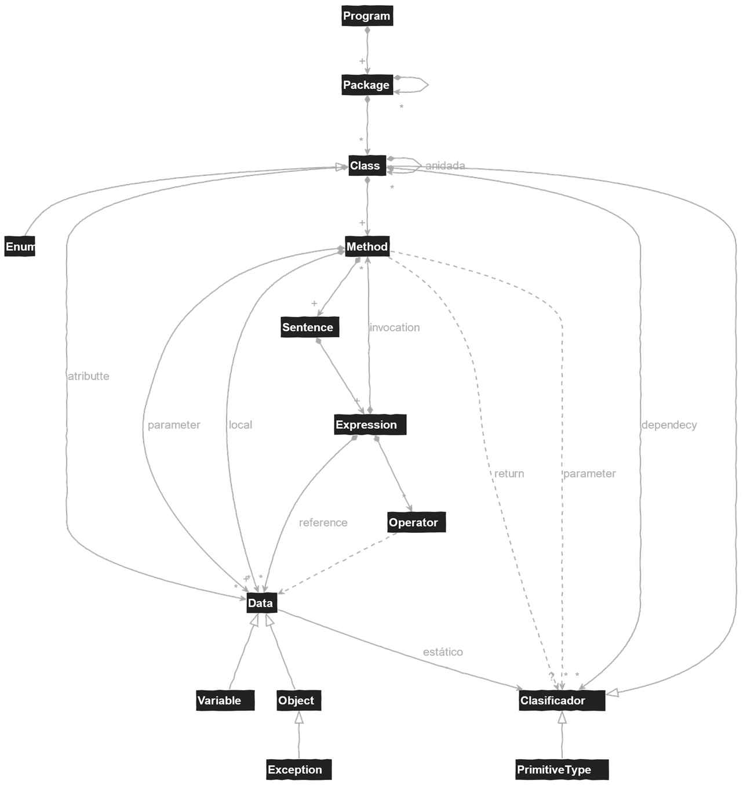

# Programa


| . | . |
|---|---|
| • Un **programa** se compone de **paquetes** que se componen de otros paquetes y **clases**, bajo el **paradigma de la programación modular**<br>&nbsp;&nbsp;&nbsp;&nbsp;• cada clase reúne **atributos** presentes en todas sus instancias, que pueden ser de **tipo primitivo** o de alguna clase junto con sus **métodos**<br>&nbsp;&nbsp;&nbsp;&nbsp;• cada método reúne parámetros y un conjunto de sentencias:<br>&nbsp;&nbsp;&nbsp;&nbsp;• crear dato, **sentencias de declaración de variables/constantes**<br>&nbsp;&nbsp;&nbsp;&nbsp;• modificar datos, **sentencias de asignación**, **entrada** y **salida**<br>&nbsp;&nbsp;&nbsp;&nbsp;• eliminar datos, asociados a los **ámbitos** de los métodos<br>&nbsp;&nbsp;&nbsp;&nbsp;• consultar datos, mediante **referencias** desde las **expresiones**<br><br>• Las sentencias contienen **expresiones** que pueden ser<br>&nbsp;&nbsp;&nbsp;&nbsp;• **expresiones simples** mediante la **mención** de los datos o **literales**<br>&nbsp;&nbsp;&nbsp;&nbsp;• **expresiones compuestas** mediante la combinación de **operadores** |  |
| • Las sentencias pueden ser **compuestas**, bajo el **paradigma de la programación estructurada**<br>&nbsp;&nbsp;&nbsp;&nbsp;• **sentencia secuencial**, para la creación de ámbitos anidados en el ámbito del progrma,<br>&nbsp;&nbsp;&nbsp;&nbsp;• **sentencia alternativa**, para alternar la ejecución de sentencias,<br>&nbsp;&nbsp;&nbsp;&nbsp;• **sentencia iterativa**, para repetir la ejecución de sentencias.<br>&nbsp;&nbsp;&nbsp;&nbsp;• **sentencias con excepciones**, para elevar, capturalas y delegarlas. | • Los datos, **constantes** o **variables**, pueden ser de **tipo**<br>&nbsp;&nbsp;&nbsp;&nbsp;• **primitivo**, para átomos de información sin propiedades e inmutables<br>&nbsp;&nbsp;&nbsp;&nbsp;• **array**, para colecciones compuestas de datos homogéneas<br>&nbsp;&nbsp;&nbsp;&nbsp;• **objetos**, para colecciones compuestas de datos heterogéneas bajo el **paradigma de la programación orientada a objetos** |


**Programa** 

**Sintaxis**:

- `<sentencia>` ::= `<sentenciaSalida>`
- `<sentenciaSalida>` ::= `console.writeln([<expresion>]);`
- `<expresion>` ::= `<literal>`
- `<literal>` ::= `<cadenaCaracteres>`

**Semántica**:

- Se ejecutan secuencialmente de arriba a abajo todas las sentencias.

***Advertencia***:

- Las ocho primeras líneas y dos últimas se explicarán en los sucesivos apartados de este documento.
- Todos los códigos deben ir acompañados en la carpeta "utils" del fichero: [utils/Console.java](https://github.com/USantaTecla-tech-java/src/blob/main/src/main/java/es/usantatecla/utils/Console.java)


```java
class App {
    
    public static void main(String[] args) {
        Console console = new Console();
        console.writeln("Hola Mundo !!!");
        console.writeln();
        console.writeln("Adios Mundo !!!");
    }
}
```

**Comentarios** 


**Sintaxis**:

- `<comentario>` ::= `//` `<caracter>`* `<saltoLinea>`
- `<comentario>` ::= `/*` `<caracter>`* `*/`
- Válidos entre secuencias de valores, operadores, identificadores, pero **nunca dentro de ellos**.
- **Inválidos** si se anidan comentarios del mismo o distinto tipo.

**Semántica**:

- Los caracteres internos al comentario no se ejecutan.
- **No recomendados**, según *clean code*.


<br>

```java
class App {
 
  public static void main(String[] args) {
    Console console = new Console();
    console.writeln(/* aquí es raro, raro, ...*/"Hola Mundo !!!");
    // gestorIO.writeln(); Dead Code!!!
    // típico comentario innecesario
    console.writeln("Adios Mundo !!!");
  }
}
```


[Anterior](../README.md) | [Subir nivel](../README.md) | [Siguiente](../u2imperativeProgramming/README.md)
